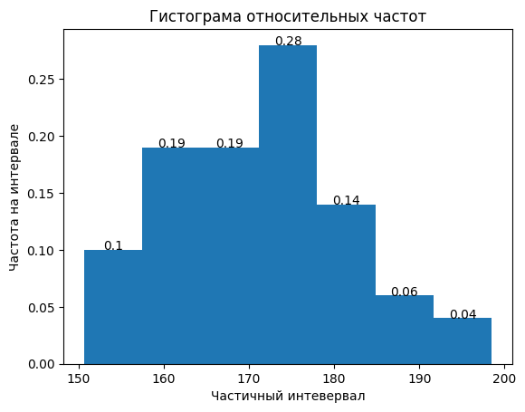
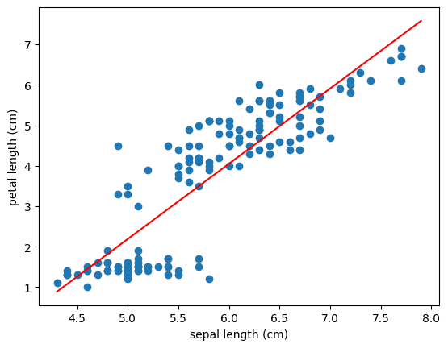

# statistics-homework-2

Прищепа Никита Иванови БИВ247

[Ссылка на репозиторий](https://github.com/nikita786574-boop/statistics-homework-2)

## task1

В приложенном файле дано распределение 100 студентов по росту. Построить гистограмму относительных частот, самостоятельно выбрав подходящий интервал для разбиения (вручную или с использованием любых программ). Найти несмещённые оценки для выборочного среднего, выборочной дисперсии.

### solution

Количество интервалов возьмём равным

$$k = 1 + \log_{2}(n)=1+\log_{2}(100)=7.643856189775$$

Целое будет $k=7$


Код

``` Python
import pandas as pd
import matplotlib.pyplot as plt

k = 7
df = pd.read_csv("./height-dz2.dat", header=None, names=['height'])

df.sort_values('height', inplace = True)

df['groups'] = pd.cut(df['height'], bins = k)

df_groups_count = df['groups'].value_counts().reset_index()

df_groups_count = pd.DataFrame({
    'groups': df_groups_count['groups'],
    'count': df_groups_count['count'],
    'frequency': df_groups_count['count']/sum(df_groups_count['count'])
}).sort_values('groups')

df_groups_count['middle'] = df_groups_count['groups'].apply(lambda x: (x.left + x.right)/2)


fig, ax = plt.subplots()
item = df_groups_count['groups'][0]
width = item.left - item.right
bars = ax.bar(df_groups_count['middle'],
              df_groups_count['frequency'],
              width = width,
              align = 'center')

ax.set_xlabel('Частичный интевервал')
ax.set_ylabel('Частота на интервале')
ax.set_title('Гистограма относительных частот')

for bar in bars:
    height = bar.get_height()
    ax.text(bar.get_x()+bar.get_width()/2, height, str(float(height)), ha = 'center')

print('Несмещенное выборочное среднее:')
print(round(df['height'].mean(), 3))

print('Несмещенная выборочная дисперсия:')
print(round(df['height'].var(), 3))

```

Гистограма относительных частот





Несмещенное выборочное среднее:

Считается по формуле

$$\overline{x} = \frac{1}{n} \cdot \sum_{i=1}^{n}x_i$$

$$\overline{x} = 171.383 $$

Несмещенная выборочная дисперсия:

Считается по формуле

$$\sigma^2 = \frac{1}{n-1} \cdot \sum_{i=1}^{n}(x_i - \overline{x})^2$$


$$\sigma^2 = 113.655$$


## task2

Воспользуйтесь встроенным датасетом Iris из библиотеки scikit-learn. Для этого выполните следующий код на python:

``` Python

from sklearn.datasets import load_iris
import pandas as pd

data = load_iris()
df = pd.DataFrame(data.data, columns = data.feature_names)

```

1. Вычислите выборочную ковариация между признаками `sepal length(cm)` и `petal length(cm)`.
2. Вычислите выборочный коэффициент корреляции между этими же признаками.
3. Проинтерпретируйте знак и значение коэффициента корреляции: укажите, существует ли линейная связь между признаками и насколько она сильна

### solution

#### 2.1
Выборочная ковариация считается по формуле

$$s_{xy} = \frac{1}{n-1}\cdot \sum_{i=1}^{n}(x_i - \overline{x})\cdot (y_i - \overline{y})$$

$$s_{xy} = 1.2743$$

#### 2.2

Выборочный коэффициент корреляции считается по формуле:

$$r_{xy}=\frac{s_{xy}}{s_{x} \cdot s_{y}}$$

Где 

$s_{x}$ - выборочное стандартное отклонение первой переменной

$s_{y}$ - выборочное стандартное отклонение второй переменной

$$r_{xy} = 0.8718$$

#### 2.3

Знаки +, значит наша модель будет предсказывать, что значение второй переменной будет увеличиваться при увеличении первой.

Корреляция получась близкой к 1, значит между переменными есть значительная связь.

Scatter plot



Из большого положительного коэффициента корреляции и графика хорошо видно, что зависимость почти линейная.

``` Python
sample_covariation = df['sepal length (cm)'].cov(df['petal length (cm)'])
print(round(sample_covariation,4))

sample_correlation = df['sepal length (cm)'].corr(df['petal length (cm)'])
print(round(sample_correlation, 4))

import matplotlib.pyplot as plt
import numpy as np
fig, ax = plt.subplots()

z = np.polyfit(df['sepal length (cm)'], df['petal length (cm)'], 1)
p = np.poly1d(z)
x_range = np.linspace(df['sepal length (cm)'].min(), df['sepal length (cm)'].max(), 100)
ax.plot(x_range, p(x_range), color = 'red')

ax.scatter(df['sepal length (cm)'], df['petal length (cm)'])
ax.set_xlabel('sepal length (cm)')
ax.set_ylabel('petal length (cm)')
```


## task 3

Вам предоставлен файл `data-dz2.txt`, содержащий выборку 1000 значений случайно величины `X`, распределённой по экспоненциальному закону:

$$f(x)=\lambda e^{-\lambda x}, x\geq0, \lambda \gt 0$$

1. Загрузите данные из файла с помощью библиотеку Numpy

``` Python
import numpy as np
data = np.loadtxt("data-dz2.txt")
```

2. Используя метод моментов, постройте две оценки параметра $\lambda$ - по первому моменту и по второму.

3. Сравните полученные оценки $\hat{\lambda_1}$ и $\hat{\lambda_2}$. Укажите, какая из них ближе к истинному значению, если известно значение параметра: $\lambda = 2$.

### solution

Метод моментов - способ определения параметров распределения, приравнивая теоретические моменты выборочным

Первый момент - выборочное среднее

$$\hat\mu_1 = \frac{1}{n} \sum_{i=1}^{n}x_i$$

Теоретически рассчитывается для экспоненциального распределения так:

$$\mu = \frac{1}{\lambda}$$

``` Python
print(round(data.mean(), 4))
```

$$\hat{\mu_1}= 0.4863=\mu=\frac{1}{\lambda}$$

$$\hat{\lambda_1} = 2.0565$$

Второй момент равен математическому ожиданию квадрата случайной величины

$$\hat{\mu_2} = \frac{1}{n}\sum_{i=1}^{n}x_i^2$$

$$\mu_2 = E[X^2]=D[X] - (E[X])^2=D[X]+\mu_1^2$$

Для экспоненциального распределения 

$$D[X] = \frac{1}{\lambda^2}$$

$$\mu_2 = \frac{1}{\lambda^2}+\frac{1}{\lambda^2}=\frac{2}{\lambda^2}=\hat{\mu_2}$$

$$\lambda = \sqrt{\frac{2}{\hat{\mu_2}}}$$

$$\hat{\mu_2}=0.4726$$

$$\hat{\lambda_2} = 2.0571$$

$\hat{\lambda_1} = 2.0565$

$\hat{\lambda_1} - \lambda = 0.0565 = \delta_1$

$\hat{\lambda_2} - \lambda = 0.0571 = \delta_2$

$$\delta_2>\delta_1$$

Значит, значение параметра, полученное при помощи второго момента сильнее отличается от реального, чем значение параметра, полученное при помощи второго момента.


``` Python
print(round(data.mean(), 4))
mean = data.mean()
lamb_1 = 1/mean
print(round(lamb_1,4))

moment_2 = 0
for i in range(len(data)):
    moment_2 += data[i]*data[i]
moment_2 /= len(data)
print(round(moment_2,4))
lamb_2=np.sqrt(2/moment_2)
print(round(lamb_2,4))

print(round(abs(lamb_1-2),4))
print(round(abs(lamb_2-2),4))
```